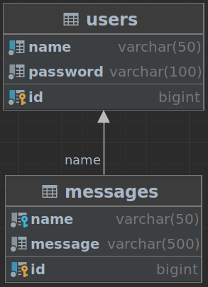

# java-security-jwt

## Description
This service was developed as part of a test task. It demonstrates how to secure REST APIs and authenticate requests with a JWT token.

### Used technologies
Java (11), Spring Boot, Lombok, Hibernate, PostgreSQL, JWT, Maven, Docker, Javadoc, Mockito, Junit

---

#### Service start on port 8081.</br>
#### Service has a separate Database on port 6541.</br>
#### ER-Diagram of the database of the main service


The following commands are available in this service:
#### 1. To manage users:
- **POST** /*registration* endpoint. The username and password are sent in json format.The body of the request is the ***RegistrationRequest*** class. Add new user with password to database. The body of the response is the ***UserDto*** class (it contains only id and username). If a user with the same name already exists, an appropriate exception will be thrown;
- **POST** /*authentication* endpoint. The username and password are sent in json format. The body of the request is the ***AuthenticationRequest*** class. If the name and password match the entry in the database, then a token is generated and sent in json format. The body of the response is the ***AuthenticationResponse*** class. Else an appropriate exception will be thrown.

#### 2. To manage messages:
- **POST** /*messages* endpoint. The username and message are sent in json format. The body of the request is the ***Messages*** class. The ***Authorization*** header is also added to the endpoint. It is equal to **Bearer_{token}**. In case of successful verification of the token, the received message will be saved to the database. If the text of the message is in the format "history N", where "N" is a number, then the last N messages sent by this user should be uploaded.
  
*P.S.* Recording and receiving messages is done through one ***POST*** endpoint, since the task was built accordingly, otherwise I would use the ***GET*** endpoint to receive messages.

### [Link to file with curl commands:](curl-commands.md)

### How to run this project :

#### First you need to build the project

```sh
##build the project
mvn clean install
```

#### Next, you can build and run containers

```sh
##start up all containers. Use the -d option to start up in deamon mode
docker-compose up
```

### How to stop this project :
```sh

##stop the running containers
docker-compose stop
```